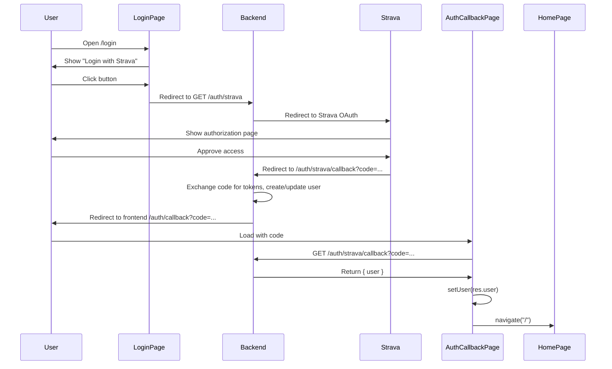

# Auth Flow

This document describes how authentication works in the Street Keeper frontend: Strava OAuth, development mode bypass, and protected routes.

---

## Table of Contents

1. [Overview](#overview)
2. [Strava OAuth Flow](#strava-oauth-flow)
3. [Development Mode](#development-mode)
4. [Auth Context](#auth-context)
5. [Protected Routes](#protected-routes)
6. [Backend Integration](#backend-integration)

---

## Overview

- **Production:** User logs in via Strava OAuth. Backend redirects to Strava; after approval, Strava redirects back to the backend callback; backend returns user data; frontend stores user and uses `x-user-id` (or future session/JWT) for API calls.
- **Development:** User can bypass OAuth by entering a user UUID; frontend sets `x-user-id` header on all API requests.
- **Protected routes:** Require authentication; unauthenticated users are redirected to `/login`.

---

## Strava OAuth Flow



### Steps

1. **Login page** (`/login`): User clicks "Login with Strava". Frontend redirects to `GET {API_BASE_URL}/auth/strava`. Backend redirects to Strava.
2. **Strava:** User approves. Strava redirects to the backend callback URL with `?code=...`.
3. **Backend callback:** Backend exchanges `code` for tokens, creates or updates the user, and redirects to the **frontend** URL (e.g. `http://localhost:5173/auth/callback?code=...`). Backend must be configured to redirect to the frontend origin.
4. **Auth callback page** (`/auth/callback`): Frontend reads `code` from the URL, calls `authService.getCallbackResponse(code)` (which hits `GET /auth/strava/callback?code=...`). Backend returns `{ success: true, user }`. Frontend calls `setUser(res.user)` and navigates to `/`.

### Error Handling

- **User denies:** Strava redirects with `?error=access_denied`. Backend may redirect to frontend with `?error=access_denied`. Login page shows a message; user can try again.
- **Missing or invalid code:** Callback page shows an error and a link to retry login.

---

## Development Mode

When developing without Strava, use a known user UUID:

1. On **Login page**, enter the user UUID in the "Development" input.
2. Click **"Use Dev User"**. Frontend calls `authService.setDevUserId(userId)` and `setUser({ id: userId, name: 'Dev User' })`.
3. The API client sends `x-user-id: {userId}` on every request. Backend uses this header to identify the user when not using OAuth.

Dev user ID is stored in `localStorage` and restored on reload by `AuthContext` (so you stay "logged in" during development).

---

## Auth Context

`AuthContext` provides auth state and methods. Wrap the app in `AuthProvider` (in `App.tsx`).

### API

| Property / method | Type                     | Description                                                                                 |
| ----------------- | ------------------------ | ------------------------------------------------------------------------------------------- |
| `user`            | `AuthUser \| null`       | Current user or null                                                                        |
| `isLoading`       | `boolean`                | True while checking auth on mount                                                           |
| `isAuthenticated` | `boolean`                | True when `user !== null`                                                                   |
| `login()`         | `() => void`             | Redirects to Strava OAuth (full page)                                                       |
| `logout()`        | `() => void`             | Clears auth (token, localStorage), redirect to login is caller's responsibility             |
| `setUser(user)`   | `(user \| null) => void` | Set user (e.g. after OAuth callback); updates API client header and optionally localStorage |

### Initialization (on mount)

1. **Dev user:** If `localStorage` has a dev user ID, restore it and set `user` to `{ id: devUserId, name: 'Dev User' }`. Skip step 2.
2. **Current user:** Call `authService.getCurrentUser()` (e.g. `GET /auth/me`). On success, set `user` and API client header. On failure, try restoring user from `localStorage` (e.g. after OAuth callback and refresh).
3. Set `isLoading` to false.

---

## Protected Routes

Routes that require authentication are wrapped in `ProtectedRoute`:

```tsx
<Route
  element={
    <ProtectedRoute>
      <AppLayout />
    </ProtectedRoute>
  }
>
  <Route index element={<HomePage />} />
  <Route path="projects" element={<ProjectsPage />} />
</Route>
```

- **Loading:** `ProtectedRoute` shows "Loading..." while `isLoading` is true.
- **Not authenticated:** Renders `<Navigate to={ROUTES.LOGIN} replace />` with `state={{ from: location }}` so the login page can redirect back after auth.
- **Authenticated:** Renders children (e.g. `AppLayout` and its nested routes).

---

## Backend Integration

- **Auth endpoints:** See backend [FRONTEND_GUIDE.md](../../backend/src/docs/FRONTEND_GUIDE.md) and [auth.routes.ts](../../backend/src/routes/auth.routes.ts).
- **API client:** Sends `x-user-id` with the current user ID (from dev mode or after OAuth). Backend uses this to authorize requests.
- **Callback URL:** Backend Strava redirect URI must point to the backend (e.g. `http://localhost:8000/api/v1/auth/strava/callback`). After handling the callback, the backend redirects the **browser** to the frontend (e.g. `http://localhost:5173/auth/callback?code=...`). How the backend does that (e.g. redirect response, or frontend URL in config) is backend-specific.
