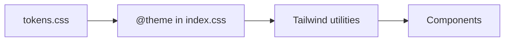

# Design Tokens

This document describes the design tokens used in the Street Keeper frontend: where they live, how they map to Tailwind, and how to change the look (including moving away from the wireframe style). The single source of truth is [src/styles/tokens.css](../styles/tokens.css).

---

## Table of Contents

1. [Overview](#overview)
2. [Token Reference](#token-reference)
3. [Tailwind Mapping](#tailwind-mapping)
4. [Dark Mode](#dark-mode)
5. [Wireframe Aesthetic](#wireframe-aesthetic)
6. [Customization](#customization)
7. [Accessibility](#accessibility)

---

## Overview

Tokens are CSS custom properties defined in `tokens.css` and mapped into Tailwind in `index.css` via `@theme`. Components use Tailwind classes (e.g. `bg-surface`, `text-text`) that resolve to these variables, so changing tokens updates the whole app.



---

## Token Reference

### Colors (semantic names)

| Token | Light default | Dark default | Purpose |
|-------|----------------|--------------|---------|
| `--color-bg` | `#f9f9f9` | `#121212` | Page background |
| `--color-surface` | `#ffffff` | `#1e1e1e` | Cards, inputs, modals |
| `--color-text` | `#000000` | `#f0f0f0` | Primary text |
| `--color-text-muted` | `#555555` | `#a0a0a0` | Secondary text |
| `--color-border` | `#000000` | `#e0e0e0` | Borders, shadows |
| `--color-accent` | `#000000` | `#ffffff` | Primary actions |
| `--color-danger` | `#dc2626` | `#f87171` | Errors, destructive |
| `--color-success` | `#16a34a` | `#4ade80` | Success |
| `--color-warning` | `#ca8a04` | `#facc15` | Warnings |
| `--color-focus` | `#000000` | `#ffffff` | Focus ring |

Use semantic names (e.g. `--color-surface`) instead of visual names (e.g. `--color-white`) so light/dark and future themes stay consistent.

### Typography

| Token | Value | Notes |
|-------|--------|------|
| `--font-family` | `"Courier New", Courier, monospace` | Wireframe style |
| `--font-size-sm` | `0.875rem` (14px) | |
| `--font-size-base` | `1rem` (16px) | Minimum for body (a11y) |
| `--font-size-lg` | `1.125rem` (18px) | |
| `--font-size-xl` | `1.5rem` (24px) | |
| `--font-size-2xl` | `2rem` (32px) | |
| `--font-size-3xl` | `3rem` (48px) | |
| `--line-height` | `1.5` | |
| `--font-weight-normal` | `400` | |
| `--font-weight-bold` | `700` | |

### Spacing

| Token | Value |
|-------|--------|
| `--space-1` | 0.25rem (4px) |
| `--space-2` | 0.5rem (8px) |
| `--space-3` | 0.75rem (12px) |
| `--space-4` | 1rem (16px) |
| `--space-6` | 1.5rem (24px) |
| `--space-8` | 2rem (32px) |
| `--space-12` | 3rem (48px) |
| `--space-16` | 4rem (64px) |

Use in custom CSS as `var(--space-4)`. Tailwind’s default spacing (e.g. `p-4`, `gap-2`) is used in components; these tokens are for consistency when you need exact token values.

### Borders and shadows

| Token | Value | Purpose |
|-------|--------|---------|
| `--border-width` | `2px` | Default border width |
| `--border-radius` | `0` | Wireframe: no rounding |
| `--border-radius-full` | `9999px` | Avatars, pills |
| `--shadow-sm` | `2px 2px 0 var(--color-border)` | Hard offset shadow |
| `--shadow-md` | `4px 4px 0 var(--color-border)` | Larger hard shadow |

---

## Tailwind Mapping

In `index.css`, `@theme` maps tokens to Tailwind color utilities:

```css
@theme {
  --color-bg: var(--color-bg);
  --color-surface: var(--color-surface);
  --color-border: var(--color-border);
  --color-text: var(--color-text);
  --color-text-muted: var(--color-text-muted);
  --color-accent: var(--color-accent);
  --color-danger: var(--color-danger);
  --color-success: var(--color-success);
  --color-warning: var(--color-warning);
  --color-focus: var(--color-focus);
}
```

Resulting utilities (examples):

| Use case | Tailwind class |
|----------|-----------------|
| Page background | `bg-bg` |
| Card/input background | `bg-surface` |
| Borders | `border-border` or `border-2 border-border` |
| Primary text | `text-text` |
| Secondary text | `text-text-muted` |
| Errors | `text-danger` |
| Success | `text-success` |
| Buttons (primary) | `bg-accent text-surface` |
| Focus ring (if needed beyond global) | `ring-2 ring-focus` |

Typography and spacing are not currently in `@theme`; use Tailwind’s defaults (e.g. `text-sm`, `p-4`) or custom CSS with `var(--font-size-base)` etc.

---

## Dark Mode

Dark mode is class-based: add `dark` to `<html>` (or a wrapper with `data-theme="dark"`). `tokens.css` defines:

```css
.dark,
[data-theme="dark"] {
  --color-bg: #121212;
  --color-surface: #1e1e1e;
  /* ... all color overrides */
}
```

Theme is toggled in `lib/theme.ts` via `toggleTheme()` / `initTheme()` and persisted in `localStorage` under the key `"theme"`. No extra Tailwind dark: prefix is needed for these tokens because the variables themselves switch.

---

## Wireframe Aesthetic

The default tokens implement a “wireframe” look:

- **No radius**: `--border-radius: 0`
- **Hard shadows**: `2px 2px 0` / `4px 4px 0` using `--color-border`
- **Monospace**: `--font-family` set to Courier
- **High contrast**: Black/white and strong borders

To keep tokens but soften the look, see [Customization](#customization).

---

## Customization

### Change colors only

Edit the `:root` (and `.dark`) blocks in `tokens.css`. Only color values need to change; names stay the same so all `bg-surface`, `text-text`, etc. update.

### Add rounded corners

In `tokens.css`:

```css
:root {
  --border-radius: 8px;   /* was 0 */
}
```

Then use `rounded-[var(--border-radius)]` or add a Tailwind theme mapping for radius if desired.

### Softer shadows

In `tokens.css`:

```css
:root {
  --shadow-sm: 0 1px 2px rgba(0, 0, 0, 0.1);
  --shadow-md: 0 4px 6px rgba(0, 0, 0, 0.1);
}
```

### Different font

In `tokens.css`:

```css
:root {
  --font-family: "Inter", system-ui, sans-serif;
}
```

Ensure the font is loaded (e.g. in `index.html` or a CSS import).

### New token

1. Add the variable in `tokens.css` (`:root` and `.dark` if it’s a color).
2. If it should be a Tailwind color, add it to `@theme` in `index.css`:
   ```css
   @theme {
     --color-my-token: var(--color-my-token);
   }
   ```
3. Use `bg-my-token` / `text-my-token` etc. in components.

---

## Accessibility

- **Contrast**: Choose `--color-text` and `--color-bg` (and surface/border) to meet WCAG AA (4.5:1 normal text, 3:1 large). Check both light and dark in a contrast checker.
- **Focus**: `--color-focus` is used for the global `:focus-visible` outline in `index.css`. Ensure it contrasts with both light and dark backgrounds.
- **Reduced motion**: `tokens.css` includes:
  ```css
  @media (prefers-reduced-motion: reduce) {
    * { animation-duration: 0.01ms !important; transition-duration: 0.01ms !important; ... }
  }
  ```
  Avoid adding critical information only in motion.

---

## Quick Reference

| Goal | Where | What to change |
|------|--------|----------------|
| Page/card background | tokens.css | `--color-bg`, `--color-surface` |
| Text and borders | tokens.css | `--color-text`, `--color-border` |
| Rounded corners | tokens.css | `--border-radius` |
| Font | tokens.css | `--font-family` |
| Dark mode colors | tokens.css | `.dark` block |
| New Tailwind color | index.css `@theme` | Add `--color-name: var(--color-name);` |
