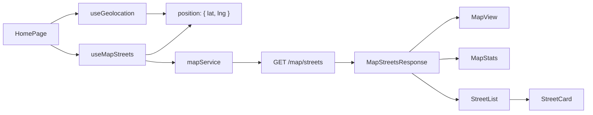

# Home Page

This document describes the Home page feature: map view of streets the user has run (completed = green, partial = yellow), with geolocation and street stats.

---

## Table of Contents

1. [Overview](#overview)
2. [Data Flow](#data-flow)
3. [Component Hierarchy](#component-hierarchy)
4. [Geolocation](#geolocation)
5. [Street Status](#street-status)
6. [Hooks](#hooks)
7. [Backend API](#backend-api)

---

## Overview

The Home page shows streets the user has run on, near their current location. Each street is shown with:

- **Status:** Completed (green) or partial (yellow). Completed means the user has reached at least 90% coverage on that street at least once.
- **Stats:** Run count, completion count, first/last run dates, length, percentage. Shown in an expandable row when the user clicks a street.

The page requests the user's location, then fetches `GET /map/streets` with that lat/lng and a default radius (e.g. 2000 m). It displays an interactive map (user location + street polylines), a summary (total streets, completed count, partial count), and a list of streets with expandable stats.

---

## Data Flow



1. **HomePage** mounts and calls `requestPermission()` from `useGeolocation()` (e.g. in `useEffect`).
2. **useGeolocation** requests `navigator.geolocation.getCurrentPosition`. On success it sets `position: { lat, lng }`; on failure it sets `error`.
3. **HomePage** passes `position?.lat` and `position?.lng` to **useMapStreets**. When both are set, useMapStreets fetches `mapService.getStreets(lat, lng, radius)`.
4. **mapService.getStreets** calls `GET /api/v1/map/streets?lat=...&lng=...&radius=2000` (with auth header).
5. **Backend** returns `MapStreetsResponse`: `streets`, `totalStreets`, `completedCount`, `partialCount`, `center`, `radiusMeters`.
6. **HomePage** renders **LocationPrompt** (if loading or error), then **MapView** (map + location + polylines), **MapStats** (summary), and **StreetList** (list of **StreetCard**). Each StreetCard shows one street; user can expand to see stats.

---

## Component Hierarchy

```
HomePage
├── LocationPrompt (if loading or location error)
├── MapView (position, streets)
│   ├── TileLayer (OpenStreetMap)
│   ├── LocationMarker (position)
│   └── StreetLayer (streets)
│       └── StreetPolyline (per street)
├── MapStats (totalStreets, completedCount, partialCount)
├── Card "No streets..." (if streets.length === 0)
└── StreetList
    └── StreetCard (per street)
        ├── Button (status dot, name, percentage, run count)
        └── Expanded stats (type, length, run count, completion count, dates)
```

- **LocationPrompt:** Shown while requesting geolocation or when there is an error. "Try again" calls `requestPermission()`.
- **MapView:** Interactive Leaflet map with fixed height (default 400px). Shows OpenStreetMap tiles, user location (circle marker), and street polylines (green = completed, yellow = partial). Pan and zoom with mouse/touch; scroll wheel zooms. Click a street line or the location marker to open a popup (street name/stats or "Your location").
- **MapStats:** One line with total streets, completed count, partial count (using design tokens for success/warning).
- **StreetList:** Renders a list of StreetCards; manages which street is expanded via `expandedOsmId` and `onToggleExpand`.
- **StreetCard:** One row per street: status dot (green/yellow), name, percentage, run count; click to expand/collapse stats.

### Map interaction

- **Pan:** Drag the map with mouse or touch.
- **Zoom:** Scroll wheel or use +/- controls (if enabled). Map is initially centered on the user and zoom level 15 when position is available.
- **Popups:** Click a street polyline to see name, percentage, and run count. Click the location marker to see "Your location".
- **Empty map:** If the user has no streets in the area, the map still shows their location; only the list shows "No streets with progress...".

---

## Geolocation

- **Permission:** The page calls `navigator.geolocation.getCurrentPosition` with `enableHighAccuracy: true`. The browser shows a permission prompt.
- **Errors:** If the user denies or the API is unavailable, **LocationPrompt** shows an error and a "Try again" button.
- **No auto-retry:** The hook does not retry automatically; the user must click "Try again" or refresh.

---

## Street Status

- **Completed (green):** `street.status === "completed"` — i.e. the user has ever reached at least 90% coverage on that street (`everCompleted` from backend).
- **Partial (yellow):** `street.status === "partial"` — the user has some progress but has never reached 90%.

Backend sets `status` from `everCompleted`: once a street is completed, it stays green. See backend [MAP_FEATURE.md](../../backend/src/docs/MAP_FEATURE.md).

---

## Hooks

### useGeolocation()

Returns: `{ position, error, isLoading, requestPermission }`.

- Does **not** request on mount; the page should call `requestPermission()` in a `useEffect` if it wants to request on load.
- `position` is `{ lat, lng }` or null.
- `error` is a string or null (e.g. "Location access denied or unavailable").

### useMapStreets(lat, lng, radius?)

Returns: `{ data, isLoading, error, refetch }`.

- Runs a fetch when `lat` and `lng` are both non-null. Uses a `cancelled` flag so the effect cleanup cancels in-flight requests.
- `data` is `MapStreetsResponse | null`.
- `refetch()` re-runs the fetch with the current lat/lng/radius.

---

## Backend API

- **Endpoint:** `GET /api/v1/map/streets`
- **Query params:** `lat` (required), `lng` (required), `radius` (optional, default 2000, max 10000).
- **Auth:** Required (e.g. `x-user-id` header).
- **Response:** See [MapStreetsResponse](../../backend/src/types/map.types.ts) and backend [MAP_FEATURE.md](../../backend/src/docs/MAP_FEATURE.md).

Frontend types mirror the backend: `MapStreet`, `MapStreetStats`, `MapStreetsResponse` in `types/api.types.ts`.
